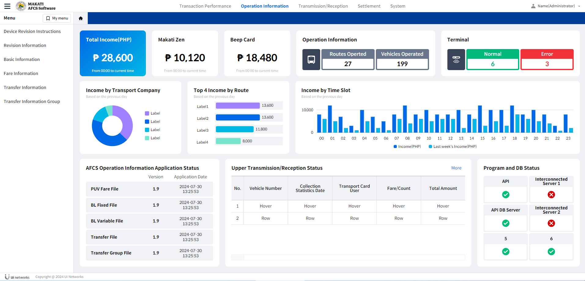

### 마카티 AFCS 리액트 퍼블리싱


+ 마카티 공통페이지 리액트 퍼블리싱입니다. (jsx, scss)

```
- git clone http://git.uinetworks.kr/design/makati_template.git
- npm install
- npm start
```

+ pages : 마카티 페이지, page : admin_template 참고페이지

+ CommonLayout1~4.jsx: 공통레이아웃 페이지, DashBoard1등 기타 디자인 페이지

+ layout.scss, grid.scss 하단에 scss 추가작업중

+ _mixin.scss 에 공통컬러 추가하는 경우 있음
